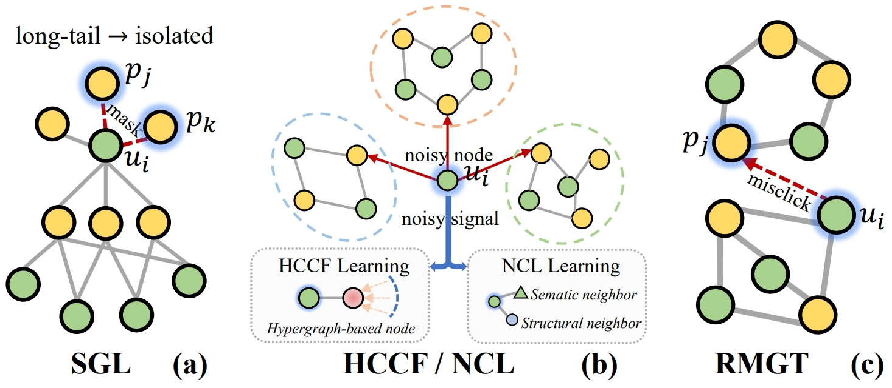
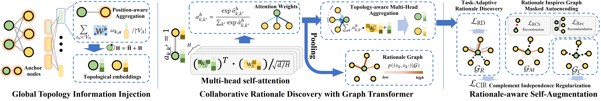

# Graph Transformer for Recommendation
This is the PyTorch implementation for GFormer model proposed in this paper:

 >**Graph Transformer for Recommendation**  
 > Chaoliu Li, Lianghao Xia, Xubin Ren, Yaowen Ye, Yong Xu, Chao Huang*\
 >*SIGIR 2023*
 
## Introduction
This paper presents a novel approach to representation learning in recommender systems by integrating generative self-supervised learning with graph transformer architecture. We highlight the importance of high-quality data augmentation with relevant self-supervised pretext tasks for improving performance. Towards this end, we propose a new approach that automates the self-supervision augmentation process through a rationale-aware generative SSL that distills informative user-item interaction patterns. The proposed recommender with Graph Transformer (GFormer) that offers parameterized collaborative rationale discovery for selective augmentation while preserving global-aware user-item relationships. In GFormer, we allow the rationale-aware SSL to inspire graph collaborative filtering with task-adaptive invariant rationalization in graph transformer. The experimental results reveal that our GFormer has the capability to consistently improve the performance over baselines on different datasets. Several in-depth experiments further investigate the invariant rationale-aware augmentation from various aspects.

  In this work,  we propose a new recommender system,Ration-aware Graph Transformer for Recommendation(GFormer), to automatically distill masked self-supervised signals with task-adaptive collaborative rationales. We take inspiration from ration discovery to bridge the gap between graph masked autoencoder with task-adaptive augmentation. To be specific, we develop a topology-aware graph transformer to be integrated into the user-item interaction modeling, to enable collaborative rationale discovery. The overview of our model architecture  is given below.

## Environment
The codes of GFormer are implemented and tested under the following development environment:
  

PyTorch:

<ul>
<li>python=3.8.13</li>
<li>torch=1.9.1</li>
<li>numpy=1.19.2</li>
<li>scipy=1.9.0</li>
<li>networkx = 2.8.6</li>
</ul>
  
## Datasets
We utilize three datasets for evaluating GFormer: <i>Yelp, Ifashion, </i>and <i>Lastfm</i>. Note that compared to the data used in our previous works, in this work we utilize a more sparse version of the three datasets, to increase the difficulty of recommendation task. Our evaluation follows the common implicit feedback paradigm. The datasets are divided into training set, validation set and test set by 70:5:25.
| Dataset | \# Users | \# Items | \# Interactions | Interaction Density |
|:-------:|:--------:|:--------:|:---------------:|:-------:|
|Yelp   |$42,712$|$26,822$|$182,357$|$1.6\times 10^{-4}$|
|Ifashion|$31,668$|$38,048$|$618,629$|$5.1\times 10^{-4}$|
|LastFm |$1,889$|$15,376$|$51,987$|$1.8\times 10^{-3}$|

## How to Run the Code
Please unzip the datasets first. Also you need to create the <code>History/</code> and the <code>Models/</code> directories. The command to train GFormer on the Yelp/Ifashion/Lastfm dataset is as follows. The commands specify the hyperparameter settings that generate the reported results in the paper.

<ul>
<li>Yelp<pre><code>python Main.py --data yelp --reg 1e-4 --ssl_reg 1 --gcn 3 --ctra 1e-3 --b2 1 --pnn 1</code></pre>
</li>
<li>Ifashion<pre><code>python Main.py --data ifashion --reg 1e-5 --ssl_reg 1 --gcn 2 --ctra 1e-3 --b2 1 --pnn 1</code></pre>
</li>
<li>Lastfm<pre><code>python Main.py --data lastfm --reg 1e-4 --ssl_reg 1 --gcn 2 --ctra 1e-3 --b2 1e-6 --pnn2</code></pre>
</li>
</ul>
</body></html>
